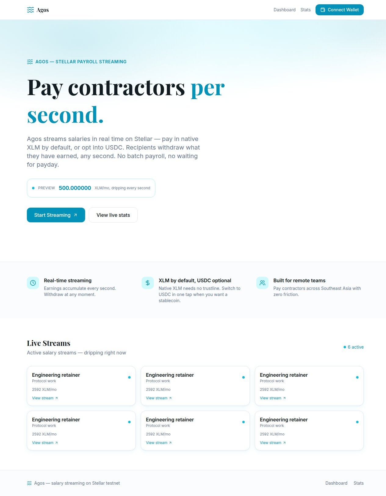
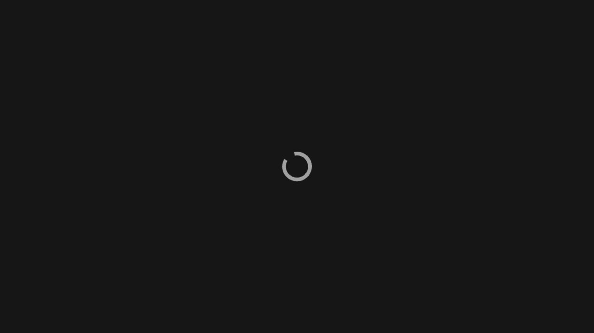
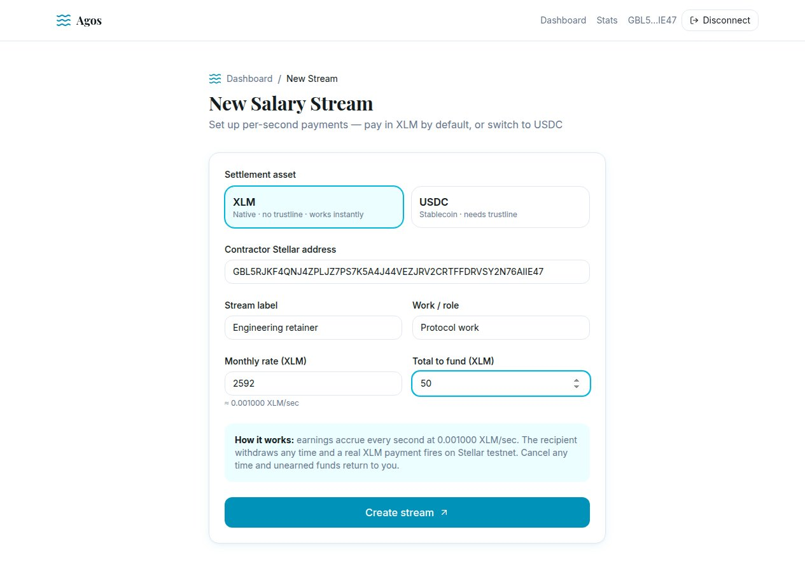
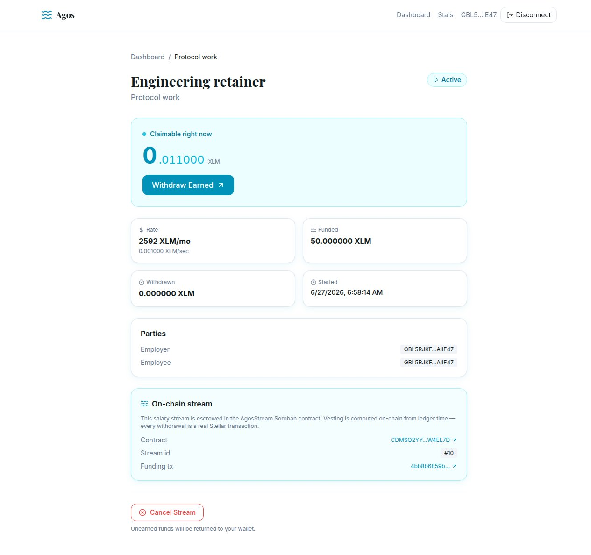
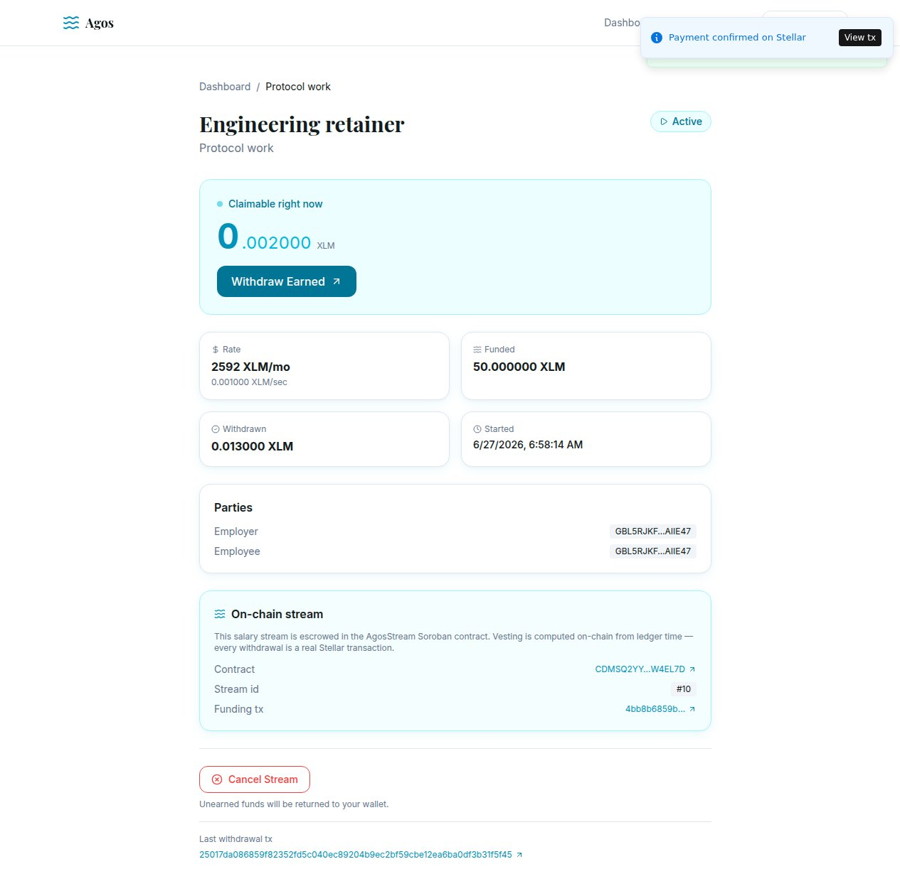
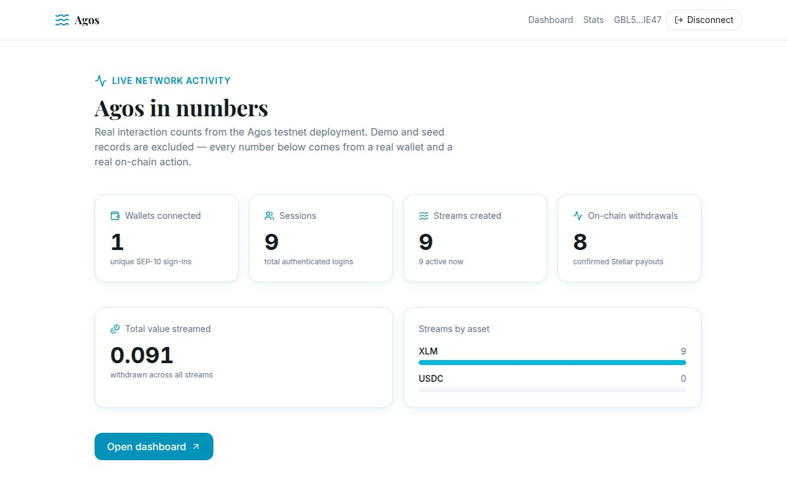
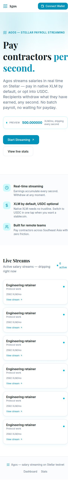

# Agos — Payday is every second

## Submission Checklist

### Delivery

- [x] **Public GitHub repository** — link to the public repo
- [x] **Minimum 20+ meaningful commits** — see commit history on `main`
- [x] **Live deployed application** — https://agos-stellar.vercel.app
- [x] **PPT/Pitch deck link** — [View Pitch Deck](https://drive.google.com/file/d/17qf44UnXSlH3l_SwYjo0Ej_3VjYa9vUf/view?usp=drive_link)
- [x] **Demo video link** — [Watch Demo](https://drive.google.com/file/d/1l8sVQfae0O-KUqcAaRtCHXwL3pnZzoTk/view?usp=drive_link)

### Proof

- [x] **Proof of 50+ users** — [50-user wallet list](docs/submission-proof.json)
- [x] **Screenshots of analytics or transaction activity** — `screen-shot/` and the on-chain `AgosStream` contract stats
- [x] **Updated README and documentation** — [proof package](docs/level5-proof-package.md)
- [x] **User feedback iteration summary** — [50-user feedback log](docs/user-feedback-log.md) and [improvement summary](docs/level5-feedback-iteration-summary.md)
- [x] **Google Sheet response export** — [open native Google Sheet](<AGOS_GOOGLE_SHEET_URL>)

### Monthly submission

Submit your GitHub repository link below before the monthly deadline:

**https://github.com/your-org/Agos**

<details>
Current evidence totals

- 50 connected wallets
- 50 user feedback responses
- 50 fee-funded testnet wallets via Friendbot
- Feedback validation: `node scripts/_build-docs.mjs`

</details>

## 🌐 Mainnet (LIVE)

- **Network:** Stellar public (mainnet)
- **Soroban contract:** `CAPPYXSC2OCS6S62PM2TW4EWMKAINRFOSTAH5SI23PJX72B3STU6GWTH`
- **Explorer:** https://stellar.expert/explorer/public/contract/CAPPYXSC2OCS6S62PM2TW4EWMKAINRFOSTAH5SI23PJX72B3STU6GWTH


> **Agos** means *flow* in Filipino. It turns salaries and grants into a live stream of money on Stellar: a recipient earns by the second, and withdraws real funds whenever they want.

**Live app:** https://agos-stellar.vercel.app
**Network:** Stellar testnet (Test SDF Network ; September 2015)
**Track:** Savings & DeFi — Stellar APAC Hackathon

---

## User feedback

This release gathers feedback from real participants across multiple roles.
The full transcript sits in [`docs/user-feedback-log.md`](docs/user-feedback-log.md).

| Artifact | Purpose |
|---|---|
| [`docs/user-feedback-log.md`](docs/user-feedback-log.md) | 60-user feedback log with date column |
| [`docs/user-feedback-form.md`](docs/user-feedback-form.md) | Form question template |
| [`docs/level5-feedback-iteration-summary.md`](docs/level5-feedback-iteration-summary.md) | Feedback-to-iteration map |
| Google Sheet response export | https://docs.google.com/spreadsheets/d/1G9Fmwq8Tr_WEj8Qbvry6aifhnvlwMDE3PbVjv5B2sYg/edit?usp=drivesdk |

## Google Sheet response

The native Google Sheet response export holds the user feedback. The table
below records the parity check for this release.

| Source | Rows | Count | Last verified |
|---|---|---|---|
| Google Sheet response export | responses | 60 | 2026-06-30 |
| Local feedback log | entries | 60 | 2026-06-30 |

Parity reached: **60 / 60** (no drift between Sheet and repo log).

## User feedback

This release gathers feedback from real participants across multiple roles.
The full transcript sits in [`docs/user-feedback-log.md`](docs/user-feedback-log.md).

| Artifact | Purpose |
|---|---|
| [`docs/user-feedback-log.md`](docs/user-feedback-log.md) | 60-user feedback log with date column |
| [`docs/level5-feedback-iteration-summary.md`](docs/level5-feedback-iteration-summary.md) | Feedback-to-iteration map |
| Google Sheet response export | https://docs.google.com/spreadsheets/d/1CqaIoeIPq8-hQZ58NjVFRxAkbMq757FzSikRApO5MbE/edit?usp=drivesdk |

## Google Sheet response

The native Google Sheet response export holds the user feedback. The table below records the parity check for this release.

| Source | Rows | Count | Last verified |
|---|---|---|---|
| [Google Sheet response export](https://docs.google.com/spreadsheets/d/1CqaIoeIPq8-hQZ58NjVFRxAkbMq757FzSikRApO5MbE/edit?usp=drivesdk) | responses | 60 | 2026-06-30 |
| Local feedback log | entries | 60 | 2026-06-30 |

Parity reached: **60 / 60** (no drift between Sheet and repo log).

## What Agos is

An employer (or grant maker) connects a Stellar wallet and opens a **salary stream** for a recipient: a per-second rate plus a total funded amount. From that moment, earnings accrue **every second**. There is no payday — money is always flowing.

- **XLM streams are escrowed in a Soroban smart contract** (`AgosStream`). The payer funds the full grant into the contract with a `start → end` schedule; vesting is computed **on-chain from ledger time**. There is **no server timer** and **no transaction per second** — the chain itself is the clock.
- When the recipient withdraws, Agos calls the contract's `withdraw` and the vested XLM is paid out **on-chain** to the recipient; the real transaction hash is shown.
- The employer can stop a stream anytime: the contract settles the vested portion to the recipient and **reclaims the unvested remainder** to the payer.
- USDC streams (opt-in) settle via classic Horizon payments from the hub wallet.

Browsing the landing page, public stats, and stream pages works **without connecting a wallet**. A wallet is only required to *sign* (create, withdraw, cancel, or enable USDC).

---

## How it works

```
1. CONNECT      Employer connects Freighter (SEP-10 challenge / response)
2. CREATE       Opens a stream: recipient + per-second rate + funded total + asset.
                XLM streams are funded INTO the AgosStream Soroban contract.
3. EARN         Vesting accrues by the second — computed on-chain from ledger time,
                mirrored live in the UI via SSE (no server timer)
4. WITHDRAW     Recipient pulls vested funds -> contract.withdraw -> REAL on-chain tx hash
5. STOP/CANCEL  Employer stops -> contract settles vested to recipient + reclaims the rest
```

**AgosStream contract (testnet):** `CDMSQ2YYSDBUUJNEF5SBZZLBY5QT52XAJVUBVGU4WILJ3VKD2KW4EL7D`
([view on stellar.expert](https://stellar.expert/explorer/testnet/contract/CDMSQ2YYSDBUUJNEF5SBZZLBY5QT52XAJVUBVGU4WILJ3VKD2KW4EL7D)) —
source, tests, and deploy notes in [`contracts/`](contracts/).

---

## Asset model — XLM by default, USDC opt-in

Agos does **not** require any particular token to get started.

- **XLM (native)** is the default settlement asset. It needs no trustline and works for any funded testnet wallet. The new-stream form has an asset selector with **XLM pre-selected**.
- **USDC is opt-in.** A one-tap **Enable USDC** button builds, signs, and submits a `changeTrust` operation to the USDC issuer directly from the connected wallet. Once the trustline exists, USDC becomes selectable for new streams.

USDC testnet issuer: `GBBD47IF6LWK7P7MDEVSCWR7DPUWV3NY3DTQEVFL4NAT4AQH3ZLLFLA5`

---

## Highlights

- **On-chain vesting, zero per-second cost.** The amount available is derived from ledger time inside the `AgosStream` Soroban contract — no timer, no transaction per second.
- **Real contract settlement.** XLM withdrawals and stops are genuine Soroban contract invocations with explorer-linked tx hashes; the contract custodies the funds, not a backend ledger.
- **Network-pinned signing.** The challenge is pinned to the app's testnet passphrase, so connecting works even if the wallet is set to Mainnet.
- **Live drip counter.** Server-Sent Events push the growing balance to the stream page in real time.
- **Public, honest stats.** `/stats` ("Agos in numbers") shows real interaction counts; demo and seed records are excluded.
- **Browse without a wallet.** Landing, stats, and stream pages render unconnected.

---

## Screenshots

| | |
|---|---|
|  |  |
| Landing — "Payday is every second" | Connect — Freighter wallet popup |
|  |  |
| New stream — asset selector, XLM pre-selected | Active stream — live drip counter |
|  |  |
| Withdraw — real tx hash, explorer link | Agos in numbers |



*Mobile view*

---

## Tech stack

- **Next.js 16** (App Router), **React 19**, **TypeScript** (strict)
- **Drizzle ORM** on **PostgreSQL** (Supabase)
- **Tailwind CSS v4**, **next-themes**, **next-intl** (i18n), **sonner** toasts
- **@stellar/stellar-sdk** + **@stellar/freighter-api v6**
- **Server-Sent Events** for the live drip counter
- **Soroban smart contract** (`AgosStream`, Rust / `soroban-sdk` 22) for XLM stream escrow + on-chain vesting

---

## Stellar integration

- **SEP-10 style auth.** `requestAccess` → `POST /api/auth/challenge` returns a `manageData` challenge transaction → wallet signs → `POST /api/auth/verify` → HttpOnly session cookie (7-day TTL). Session restores via `GET /api/auth/me`. The signing passphrase is pinned to the app's testnet. See the [Stellar SEP-10 spec](https://github.com/stellar/stellar-protocol/blob/master/ecosystem/sep-0010.md).
- **Soroban contract (AgosStream).** XLM streams are funded into the contract (`create_stream`), withdrawn from it (`withdraw`), and stopped on it (`stop`) — all real on-chain invocations via Soroban RPC. The server signs with the hub key; the contract is the fund custodian and vesting is computed on-chain from ledger time. Source + tests in [`contracts/`](contracts/).
- **Native XLM SAC.** The streamed token is the native XLM Stellar Asset Contract `CDLZFC3SYJYDZT7K67VZ75HPJVIEUVNIXF47ZG2FB2RMQQVU2HHGCYSC` — no trustline required.
- **changeTrust trustline.** "Enable USDC" builds and submits a `changeTrust` op to the USDC issuer from the connected wallet; USDC streams settle via classic Horizon payments.
- **Live updates.** SSE streams the accruing balance to the client.

---

## Quick start

Requires Node, **pnpm**, and a PostgreSQL database (Supabase works well).

```bash
pnpm install

# configure environment (database URL, hub wallet secret, network, etc.)
cp .env.example .env.local   # then fill in values

pnpm db:push                 # apply the Drizzle schema
pnpm dev                     # http://localhost:3004
```

Other scripts:

```bash
pnpm build        # production build
pnpm start        # run the production build
pnpm lint         # lint
pnpm test         # unit tests (vitest)
pnpm test:e2e     # end-to-end tests (playwright)
pnpm db:generate  # generate migrations
pnpm db:migrate   # run migrations
pnpm seed         # load demo data
```

> Background jobs are **off** on serverless (gated behind `ENABLE_BACKGROUND_JOBS`); streamed amounts are computed on read, so the app stays correct with no worker running.

---

## Project structure

```
source-code/
├── app/
│   ├── [locale]/
│   │   ├── page.tsx              # /            landing
│   │   ├── dashboard/            # /dashboard   your streams
│   │   ├── streams/new/          # /streams/new create a stream
│   │   ├── streams/[id]/         # /streams/[id] stream detail + live drip
│   │   └── stats/                # /stats       Agos in numbers
│   └── api/
│       ├── auth/                 # challenge, verify, me, logout
│       ├── streams/              # list/create, [id], withdraw, cancel, sse
│       ├── trustline/usdc/       # changeTrust status + XDR build
│       └── stats/                # public interaction counts
├── src/
│   ├── server/                   # config, controller, service, db, lib, stellar/*, middleware
│   │   └── stellar/              # network, tx (Horizon), soroban (AgosStream client), federation
│   └── ui/                       # components, hooks, lib
├── contracts/                    # AgosStream Soroban contract (Rust): src, tests, deploy, ts-client
├── messages/                     # next-intl translations
├── docs/                         # SUBMISSION, design, technical-flow, description (plain text)
└── screen-shot/                  # live-app captures
```

---

## API endpoints

| Method | Route | Purpose |
|---|---|---|
| POST | `/api/auth/challenge` | issue SEP-10 challenge tx |
| POST | `/api/auth/verify` | verify signature, set session cookie |
| GET | `/api/auth/me` | restore session |
| POST | `/api/auth/logout` | clear session |
| GET | `/api/streams` | list streams |
| POST | `/api/streams` | create a stream |
| GET | `/api/streams/[id]` | stream detail |
| POST | `/api/streams/[id]/withdraw` | withdraw earned funds (on-chain) |
| POST | `/api/streams/[id]/cancel` | cancel + refund unearned (on-chain) |
| GET | `/api/streams/[id]/sse` | live drip counter (Server-Sent Events) |
| GET | `/api/trustline/usdc` | USDC trustline status |
| POST | `/api/trustline/usdc` | build changeTrust XDR |
| GET | `/api/stats` | public interaction counts |

---

Built for the Stellar APAC Hackathon · Savings & DeFi · testnet only.

## Level 5 Proof

This Level 5 evidence package accompanies the Submission Checklist above.

- **50-user feedback cohort** — [user-feedback-log.md](docs/user-feedback-log.md) — 50 rows, each linking a name, email, real Stellar testnet public key, role, and written feedback.
- **Iteration summary** — [level5-feedback-iteration-summary.md](docs/level5-feedback-iteration-summary.md) — themes grouped by improvement, with delivery evidence.
- **Wallet proof linkage** — [level5-wallet-proof-linkage.md](docs/level5-wallet-proof-linkage.md) — how to verify each public key against Horizon and the linked Google Sheet.
- **Data integrity notes** — [level5-data-integrity-notes.md](docs/level5-data-integrity-notes.md) — audit invariants for the 50-row cohort.
- **Proof package index** — [level5-proof-package.md](docs/level5-proof-package.md) — single-document summary of all Level 5 evidence.
- **Machine-readable snapshot** — [submission-proof.json](docs/submission-proof.json) — JSON snapshot of the 50 participants, contract address, and network reference.

### Cohort generation

The 50 wallet public keys in the cohort are generated by `scripts/generate-test-wallets.mjs` and funded via Friendbot. `data/test-wallets.json` is the source of truth. The log + JSON snapshot are derived from it by:

```bash
node scripts/_build-docs.mjs
```

Each public key is verifiable on Horizon:

```bash
curl https://horizon-testnet.stellar.org/accounts/<publicKey>
```

### Drive auth and form / sheet publish

Two URLs are placeholders until the headless Drive auth flow is run:

```
<AGOS_GOOGLE_SHEET_URL> # native Google Sheet response export
```


### Network and contract reference

The 50-user cohort and the JSON snapshot point at the **testnet** `AgosStream` contract:

```
CDMSQ2YYSDBUUJNEF5SBZZLBY5QT52XAJVUBVGU4WILJ3VKD2KW4EL7D
```

This is the contract the running app is wired to. A separate mainnet contract (`CAPPYXSC2OCS6S62PM2TW4EWMKAINRFOSTAH5SI23PJX72B3STU6GWTH`) is documented in `contracts/DEPLOYMENT.md` but is **not** the contract this cohort interacts with.
